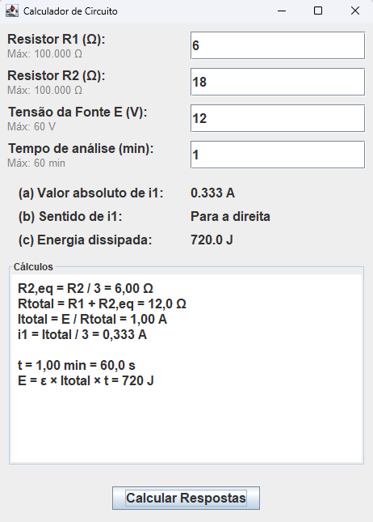
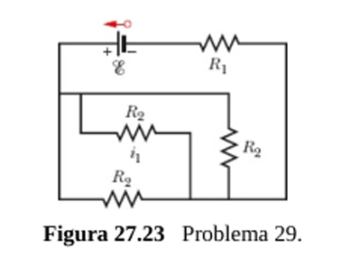

# Calculador de Circuito

Aplicação desktop em **Java Swing** para análise de um circuito resistivo: um resistor `R1` em série com três resistores `R2` iguais associados em paralelo, alimentados por uma fonte de tensão `E`. A partir dos valores informados, o programa calcula a corrente em um dos ramos paralelos, seu sentido e a energia total dissipada em um intervalo de tempo.

## Exercício

Na Fig. 27.23, R₁ = 6,00 Ω, R₂ = 18,0 Ω e a força eletromotriz da fonte ideal é ℰ = 12,0 V. Determine (a) o valor absoluto e (b) o sentido (para a esquerda ou para a direita) da corrente i₁. (c) Qual é a energia total dissipada nos quatro resistores em 1,00 min?

**Resolução**

- R2,eq = R2 / 3 = 18,0 / 3 = 6,00 Ω
- Rtotal = R1 + R2,eq = 6,00 + 6,00 = 12,0 Ω
- Itotal = E / Rtotal = 12,0 / 12,0 = 1,00 A
- i1 = Itotal / 3 = 1,00 / 3 ≈ 0,333 A
- Sentido de i1: para a direita
- t = 1,00 min = 60,0 s
- E = ℰ × Itotal × t = 12,0 × 1,00 × 60,0 = 720 J

## Interface



## Funcionalidades

- Entrada de `R1`, `R2`, tensão da fonte (`E`) e tempo de análise, com campos que aceitam apenas números.
- Validação de limites de bancada (resistências até 100 kΩ, tensão até 60 V, tempo até 60 min), com mensagens de erro quando algum valor é digitado fora da faixa.
- Cálculo automático de:
  - **(a)** Valor absoluto da corrente `i1`
  - **(b)** Sentido da corrente `i1`
  - **(c)** Energia total dissipada no tempo informado
- Painel de **Cálculos** mostrando resumidamente as fórmulas e resultados intermediários (R2,eq, Rtotal, Itotal, i1, t e E).

## Como executar

Pré-requisito: JDK instalado (Java 8 ou superior).

```bash
javac CalculadorCircuito.java
java CalculadorCircuito
```

## Circuito



- `R2,eq = R2 / 3`
- `Rtotal = R1 + R2,eq`
- `Itotal = E / Rtotal`
- `i1 = Itotal / 3`
- `E_dissipada = E × Itotal × t`

## Tecnologias

- Java SE
- Swing (interface gráfica)

## Licença

Projeto acadêmico, livre para uso e estudo.
